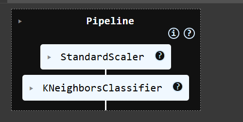

# Breast Cancer Classification (KNN)

Predicts **Malignant (1)** vs **Benign (0)** using the Breast Cancer Wisconsin (Diagnostic) dataset.

## What I built
- Preprocessing: drop `id`, encode `diagnosis` (M→1, B→0), scale features (StandardScaler)
- Model: KNN in a scikit-learn Pipeline
- Tuning: tried several K and distance metrics; **final = K=3, metric=manhattan, weights=distance**
- Metrics: ~97–98% accuracy, **Recall(Malignant) ~0.92**, confusion matrix included

## How to run
1. Open the notebook in Google Colab.
2. Upload `data.csv` from Kaggle into the Colab session.
3. Run cells from top to bottom.

## Dataset
- Breast Cancer Wisconsin (Diagnostic): on Kaggle/UCIML.

## Notes
Focused on minimizing false negatives (missed malignant cases).

---

## 🧠 Model Overview
Here’s a visual of the **KNN Pipeline** used for preprocessing and classification:

---

## 🎯 Confusion Matrix
Final model results (K=3, Metric=Manhattan):

**Interpretation:**
- **Top-left (107)** → Correctly predicted benign
- **Bottom-right (59)** → Correctly predicted malignant
- **Bottom-left (5)** → Missed malignant cases
- Overall accuracy ≈ 97%

---
